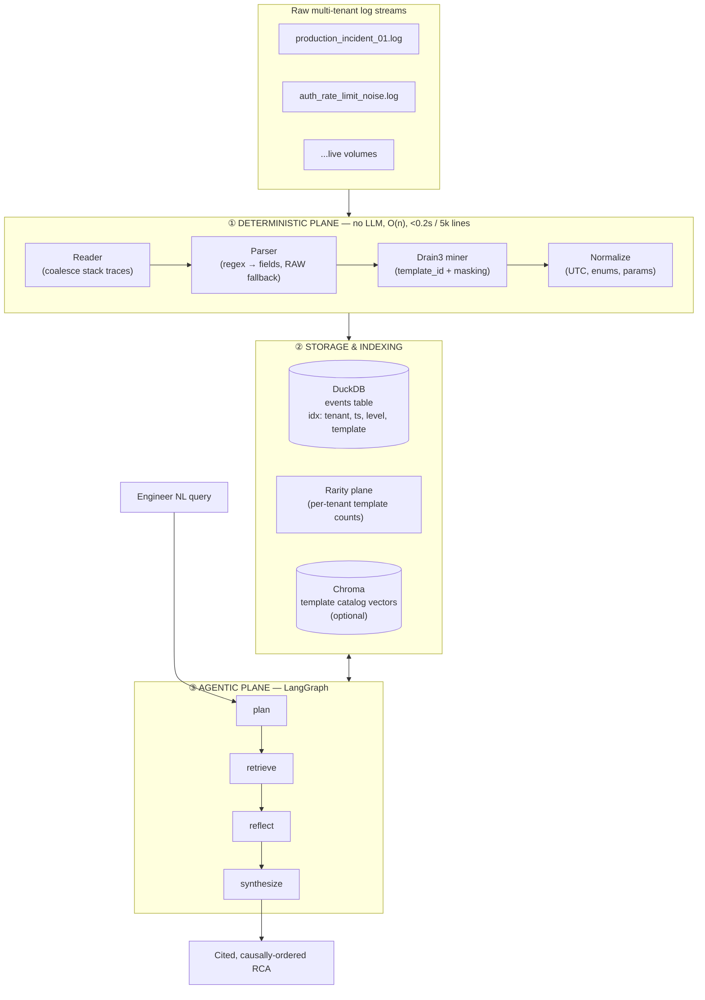
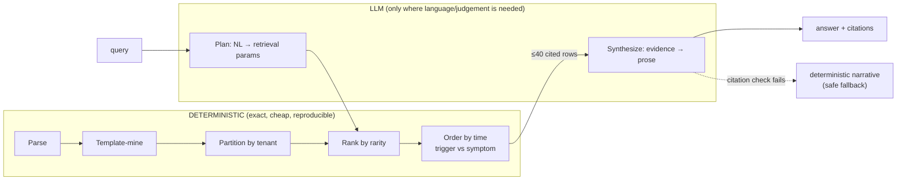
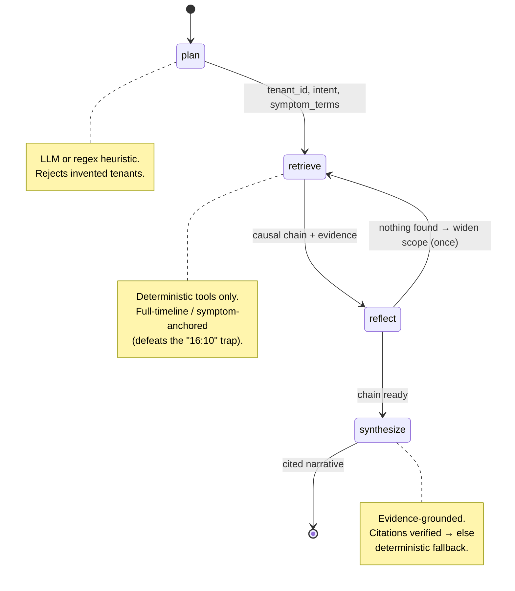
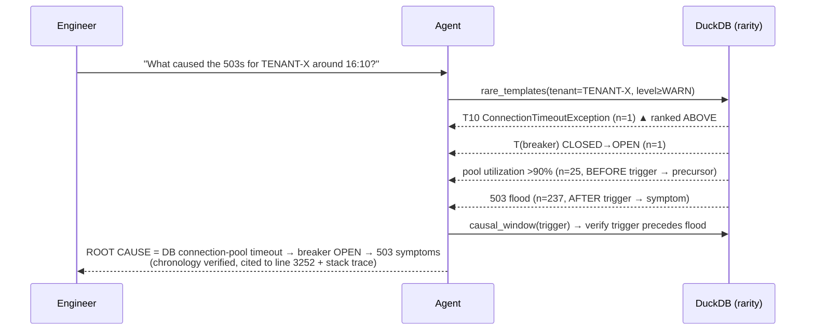
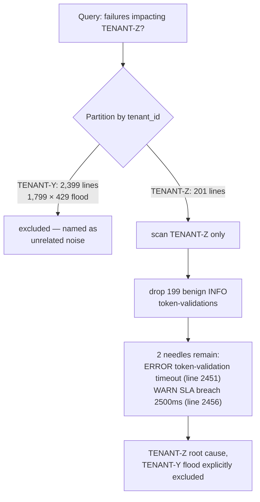
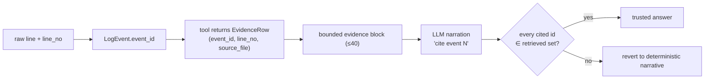
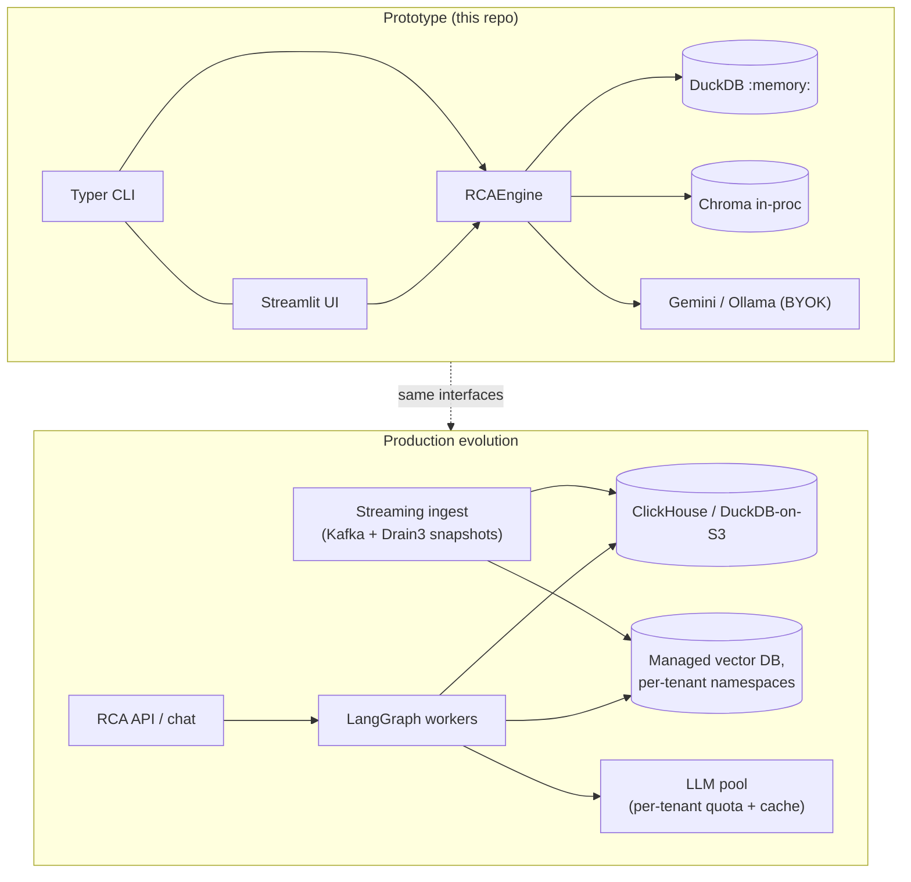

# Conceptual Architecture Blueprint — Agentic RCA Engine

This blueprint shows *how the pieces fit*. The companion [DESIGN.md](DESIGN.md) explains *why*.
The single organising idea: **a deterministic reduction stage collapses the haystack before any
AI touches it; the AI then plans retrieval and narrates verified evidence.**

---

## 1. System overview

---

## 2. The deterministic ↔ LLM boundary (the core decision)

**Rule:** anything exact (parse, filter, count, sort, classify-by-time) is code; only query
*interpretation* and *narration* are the model's — and narration is verified against retrieved
evidence before it is trusted.

---

## 3. Agent retrieval loop (state machine)

---

## 4. Scenario 1 — chronological trigger extraction

The 237-line flood is reduced to a single template row; rarity floats the 1-line cause to the
top; chronology proves it preceded the symptoms.

---

## 5. Scenario 2 — high-volume noise demultiplexing

Tenant partitioning makes the buried 2-line anomaly trivially findable and keeps the flood out
of the context window entirely — no false-positive correlation.

---

## 6. Data lineage & anti-hallucination

Every sentence in the final report is traceable to a verbatim log line; an unsupported citation
can never survive into the answer.

---

## 7. Deployment view (prototype → production)

